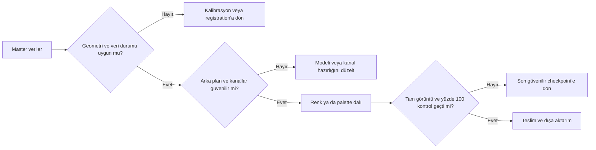

# Uygulamalı Projeler

!!! info "Sayfa Bilgisi"
    **Kategori:** Uygulamalı İş Akışları · **Düzey:** Advanced · **Tahmini okuma:** 5 dk
    **Anahtar kelimeler:** `uygulamalı proje` · `M31` · `NGC 6888` · `LRGB` · `HaRGB` · `HOO` · `SHO`

## Amaç

Bu bölüm, process sıralarını değil iki veri tipinde karar vermeyi öğretir. Genel ilkelerin canonical sahibi [Uygulamalı İş Akışları](../15-workflows/index.md), process kullanımlarının sahibi ilgili process sayfalarıdır. Buradaki sayfalar bir kararın hangi kanıtla alındığını ve bir sonraki aşamaya hangi koşulla geçildiğini gösterir.

## Proje seçimi

| Proje | Veri | Ana karar | Uygun olduğu durum |
|---|---|---|---|
| [M31 LRGB + Ha](m31-lrgb-ha/index.md) | L, R, G, B, Ha | Ha'yı doğal broadband renge yerel olarak katmak | Galaksi rengi, çekirdek ve yıldız renginin korunması |
| [NGC 6888 SHO/HOO](ngc6888-sho/index.md) | En az Ha ve OIII; SHO için SII | Zayıf OIII'yi kaybetmeden palette seçmek | Kanal SNR'ları ve morfolojileri belirgin biçimde farklı olduğunda |

## Veri seti planları

| Plan | Kanallar | Kullanım | Eksik kayıtların ele alınması |
|---|---|---|---|
| A — güçlü üç kanal | SII, Ha, OIII; her birinde güvenilir yapı | Generic SHO kararlarını sınamak | Poz süresi, optik ve kamera proje kaydından doldurulur |
| B — zayıf OIII | Ha ve OIII; OIII düşük SNR | NGC 6888 HOO/SHO dalları | Kanal histogramı, gürültü ve morfoloji karşılaştırması kaydedilir |
| C — broadband + Ha | LRGB ve Ha | M31 yerel Ha katkısı | PSF, registration ve kanal ölçeği ölçülmeden blend yapılmaz |

!!! warning "Veri gerçeği"
    Bu planlar test tasarımıdır; belirli kamera, poz süresi veya entegrasyon süresi iddiası değildir. Proje sayfasındaki “kayıt mevcut değil” alanları gerçek oturum kayıtlarıyla doldurulmadan sayısal reçeteye dönüştürülmez.

## Ortak kalite kapıları

## Görsel kanıt planı

Her proje için ham master karşılaştırması, model görüntüsü, maske görünümü, blend öncesi/sonrası ve tam görüntü ile %100 crop çiftleri gereklidir. Görsel bulunmadığında metin, gözle doğrulanmamış sonucu olmuş gibi anlatmaz.

## İlgili İş Akışları

[LRGB Galaksi](../15-workflows/lrgb-galaxy.md) · [LRGB + Ha Galaksi](../15-workflows/lrgb-ha-galaxy.md) · [SHO ve HOO](../15-workflows/sho-hoo.md) · [Veri Kalitesi](../15-workflows/data-quality-strategies.md)

## Sonraki Bölüm

[M31 LRGB + Ha projesi →](m31-lrgb-ha/index.md)
