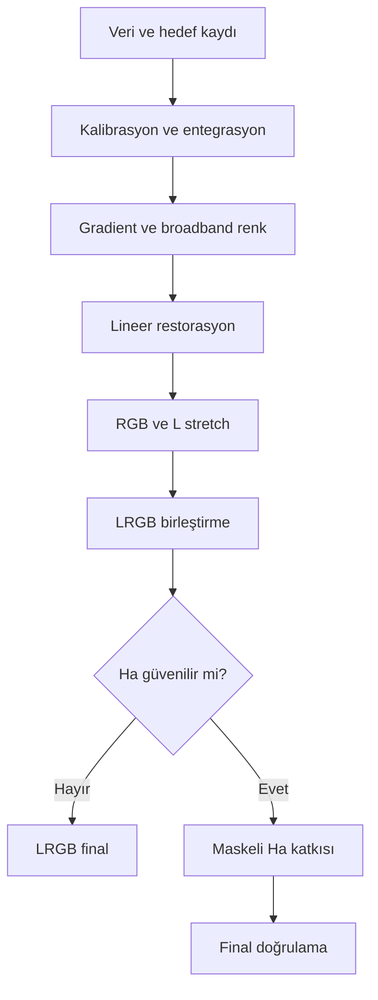

# M31 LRGB + Ha Uygulaması

!!! info "Sayfa Bilgisi"
    **Kategori:** Proje İş Akışı · **Düzey:** Advanced · **Tahmini okuma:** 7 dk
    **Anahtar kelimeler:** `M31` · `LRGB` · `HaRGB` · `galaksi` · `çekirdek` · `toz şeridi`

## Amaç

M31'in broadband rengini, çekirdeğini, toz şeritlerini ve yıldız rengini korurken Ha sinyalini yalnız güvenilir yıldız oluşum bölgelerinde görünür kılan tekrar edilebilir bir karar zinciri kurmak.

## Hangi veri için uygundur?

Ortak geometriye taşınabilecek L, R, G, B ve Ha master'ları içindir. Ha yoksa [generic LRGB](../../15-workflows/lrgb-galaxy.md), Ha yapısı gürültüden ayrılamıyorsa Ha eklemeden tamamlanan LRGB dalı seçilir.

## İş akışı özeti

## Adım adım karar noktaları

| Aşama | Karar kanıtı | Geçiş ölçütü | Geri dönüş |
|---|---|---|---|
| [1. Veri ve hedef](01-veri-ve-hedef.md) | Kanal ve çekim kaydı | Eksikler ve hedef açık | Oturum kayıtlarını tamamla |
| [2. WBPP](02-wbpp.md) | Rejection, weight ve registration | Artefaktsız master'lar | Kalibrasyon/entegrasyon |
| [3. DBE ve SPCC](03-dbe-spcc.md) | Model, background ve yıldız rengi | Gerçek halo korunmuş | Sample/model veya metadata |
| [4. BlurX ve NoiseX](04-blurx-noisex.md) | PSF, noise ve yapı | Artefakt üretmeyen lineer sonuç | İşlemi azalt veya atla |
| [5. Stretch](05-stretch.md) | Core ve dust lane | Clipping yok, ton ayrımı var | Stretch checkpoint'i |
| [6. LRGB](06-lrgb.md) | Renk ve luminance uyumu | Renk yıkanmıyor | Etki/işlem zamanı |
| [7. Ha](07-ha-entegrasyonu.md) | HII maskesi ve star exclusion | Global kırmızılaşma yok | Mask/normalization/blend |
| [8. Final](08-final.md) | Tam görüntü ve %100 crop | Halo, clipping, chroma noise yok | Son güvenilir aşama |

## Proje kararları

- Çekirdek clipped ise HDR veya kontrast işlemi kayıp veriyi geri getirmez; kısa poz kaynağı gerekir.
- Galaksi halo'su background sample alanı değildir. Model galaksiye benziyorsa düzeltme durdurulur.
- Ha tüm red channel'ın yerine geçmez; katkı yapısal maske ve broadband yıldız korumasıyla sınanır.
- Tek bir Ha yüzdesi yayınlanmaz. Ölçek, normalization ve maske her veri setinde yeniden doğrulanır.

## Ne zaman durmalı?

LRGB tek başına tamamlanabilir kaliteye ulaştığında Ha kanıtı yetersizse durun. Final görüntüde HII bölgeleri belirginleşirken çekirdek, dust lane ve yıldız rengi aynı kalıyorsa yeni işlem eklemek yerine teslim kontrolüne geçin.

## Görsel kanıt planı

Master paneli, DBE model/sonuç, LRGB öncesi/sonrası, Ha maskesi, Ha öncesi/sonrası ve core/star %100 crop çiftleri. Ekran görüntülerinde process sürümü ile checkpoint adı görünmelidir.

## İlgili kavramlar ve process sayfaları

[Signal ve Noise](../../02-pixinsight-temelleri/sinyal-ve-gurultu.md) · [Gradient Theory](../../04-gradient/gradient-theory.md) · [LRGB + Ha](../../15-workflows/lrgb-ha-galaxy.md) · [PixelMath](../../10-pixelmath/index.md)

## Önceki Bölüm

[← Uygulamalı Projeler](../index.md)

## Sonraki Bölüm

[Veri ve hedef →](01-veri-ve-hedef.md)
