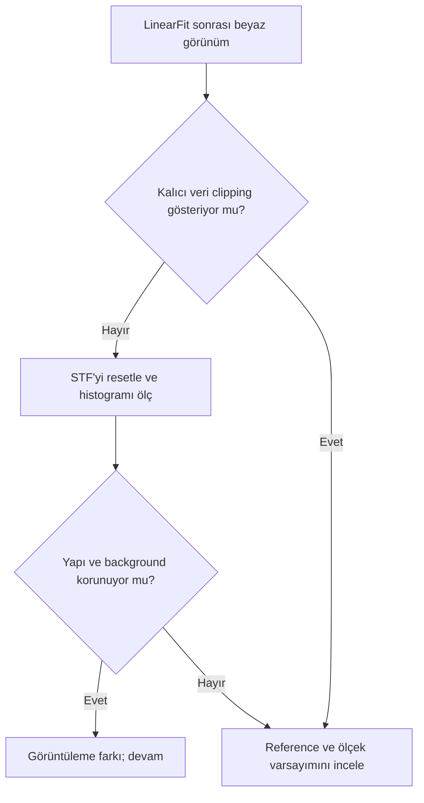

# NGC 6888: Kanal Hazırlama

!!! info "Sayfa Bilgisi"
    **Kategori:** Proje İş Akışı · **Düzey:** Expert · **Tahmini okuma:** 7 dk
    **Anahtar kelimeler:** `channel preparation` · `LinearFit` · `normalization` · `weak OIII` · `NGC 6888`

## Amaç

Ha, OIII ve varsa SII'yi ortak geometry ve anlaşılır ölçeğe getirirken zayıf kanalı beyaza yıkamamak veya noise'u signal gibi büyütmemek.

## Adım adım karar noktaları

1. Registration, crop ve gradient durumunu kanal bazında doğrulayın.
2. Aynı STF ve sabit crop ile relative signal, background ve star profiles karşılaştırın.
3. Ölçek farkı kombinasyonu bozuyorsa normalization değerlendirin; yalnız görüntüler farklı parlak göründüğü için LinearFit zorunlu değildir.
4. Reference channel'ı en parlak olduğu için değil, güvenilir signal/background ve clipping durumu nedeniyle seçin.
5. Normalization/LinearFit sonrası istatistiği ve unstretched görüntüyü kontrol edin; STF'nin otomatik yeniden hesaplanması “görüntü beyazladı” yanılsaması yaratabilir.

## Tanı dalı: LinearFit görüntüyü beyaz gösteriyor

## Kalite kapısı

| Kontrol | Geçer | Başarısızlıkta |
|---|---|---|
| Geometry | Star ve frame uyumlu | Registration'a dön |
| Background | Kanal karakteri korunuyor | Gradient/normalization ayır |
| OIII | Shell yapısı hâlâ seçiliyor | İşlemi azalt / checkpoint'e dön |
| Display | STF ile veri değişimi ayrılmış | Histogram ve reset STF |

## Alternatif yollar

Normalization gerekli değilse kanalları fiziksel ölçüm ölçeğinde tutun. OIII gürültülü ise güçlü smooth yerine maskeli, kanal bazlı lineer noise reduction veya daha fazla veri düşünün.

## Görsel kanıt planı

Öncesi/sonrası kanal paneli, histogram, aynı STF/reset STF, shell/background %100 crop ve reference seçimi kaydı.

## İlgili process ve sorun giderme

[Kanal Normalizasyonu ve LinearFit](../../09-narrowband/channel-normalization-and-weighting.md) · [OIII Kaybolması](../../14-hata-kutuphanesi/oiii-kaybolmasi.md)

## Önceki / Sonraki

[← Veri ve hedef](01-veri-ve-hedef.md) · [HOO/SHO kombinasyonu →](03-sho-kombinasyonu.md)
