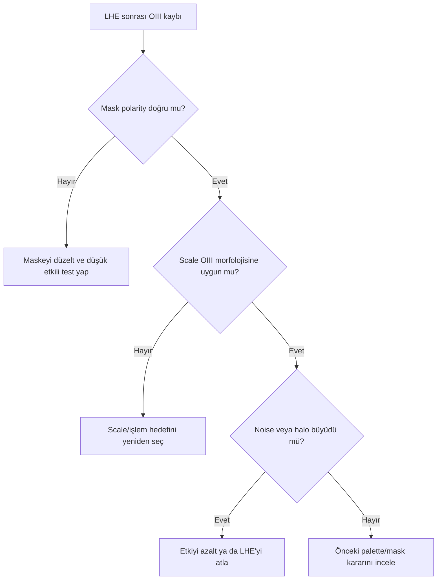

# NGC 6888: OIII Koruma ve Local Contrast

!!! info "Sayfa Bilgisi"
    **Kategori:** Proje İş Akışı · **Düzey:** Expert · **Tahmini okuma:** 7 dk
    **Anahtar kelimeler:** `OIII preservation` · `LHE` · `local contrast` · `weak OIII` · `noise protection`

## Amaç

Zayıf OIII shell'i local contrast ve final color işlemlerinde korurken background noise'u cyan yapı gibi büyütmemek.

## Adım adım karar noktaları

1. OIII yapısını işlem öncesi master ve palette görüntüsünde aynı koordinatta işaretleyin.
2. LHE yalnız belirlenmiş spatial scale'de okunabilirlik sorunu varsa ve koruma maskesi doğrulanmışsa değerlendirilir.
3. İşlemi shell crop'unda structure continuity, background crop'unda noise amplification ve yıldız crop'unda halo ile birlikte değerlendirin.
4. OIII kaybı color operation kaynaklıysa contrast eklemeyin; palette/mask aşamasına dönün.
5. OIII görünürlüğü yalnız saturation ile artıyorsa signal/noise ayrımını yeniden sınayın.

## Tanı dalı: OIII, LHE sonrasında kayboluyor

## Kalite kontrol

| Alan | Geçer | Aşırı işlem |
|---|---|---|
| Shell | Sürekli, ince yapı okunur | Kırık/gevrek kenar |
| Background | Noise karakteri kontrollü | Cyan blotch |
| Stars | Halo değişmiyor | Ringing / koyu halka |
| Full-frame | OIII doğal ağırlıkta | Neon cyan kontur |

## Alternatif yollar ve durma ölçütü

LHE yerine daha yumuşak Curves, multiscale işlem veya palette aşamasında OIII koruma seçilebilir. OIII zaten okunuyorsa local contrast eklemeyin. Yapı kazanımı noise/halo maliyetinden küçükse son güvenilir checkpoint'e dönün.

## Görsel kanıt planı

LHE kapalı/açık full-frame; shell, background ve star %100 crop; OIII maskesi ve polarity görüntüsü.

## İlgili process ve sorun giderme

[LocalHistogramEqualization](../../12-detay-ve-kontrast/local-histogram-equalization.md) · [OIII Kaybolması](../../14-hata-kutuphanesi/oiii-kaybolmasi.md) · [Multiscale](../../12-detay-ve-kontrast/index.md)

## Önceki / Sonraki

[← Maskeler](04-maskeler.md) · [Final →](06-final.md)
