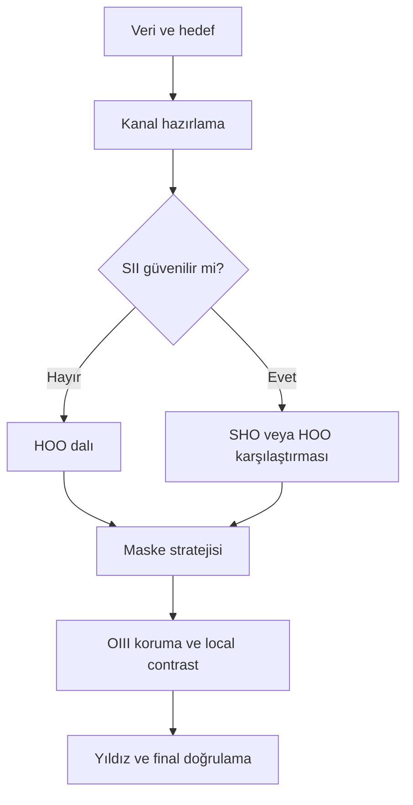

# NGC 6888: Zayıf OIII ile HOO/SHO Uygulaması

!!! info "Sayfa Bilgisi"
    **Kategori:** Proje İş Akışı · **Düzey:** Expert · **Tahmini okuma:** 7 dk
    **Anahtar kelimeler:** `NGC 6888` · `weak OIII` · `HOO` · `SHO` · `narrowband` · `Crescent Nebula`

## Amaç

Ha'ya göre zayıf OIII yapısını kaybetmeden, veri izin veriyorsa HOO veya SHO palette'e ilerleyen ve her aşamada geri dönüş kanıtı bırakan proje akışı kurmak.

## Hangi veri için uygundur?

En az registered Ha ve OIII master'ları; SHO dalı için ayrıca güvenilir SII gerekir. OIII morfolojisi noise'dan ayrılamıyorsa renk ağırlığıyla “kurtarılmaz”; daha fazla veri veya Ha-only bilimsel sınırlama kaydedilir.

## İş akışı özeti

## Aşama kapıları

| Aşama | Temel karar | Geçiş ölçütü |
|---|---|---|
| [1. Veri ve hedef](01-veri-ve-hedef.md) | Kanal kanıtı yeterli mi? | Kimlik, state, sınırlama kayıtlı |
| [2. Kanal hazırlama](02-kanal-hazirlama.md) | Normalize / LinearFit gerekli mi? | Yapı beyaza yıkanmadan karşılaştırılabilir |
| [3. HOO/SHO](03-sho-kombinasyonu.md) | Hangi palette veriyle savunulabilir? | OIII görünür, kanal anlamı kayıtlı |
| [4. Maskeler](04-maskeler.md) | Koruma/seçim doğru mu? | Maske gri tonlu ve doğru polaritede |
| [5. OIII koruma](05-oiii-koruma.md) | LHE/local contrast gerekli mi? | OIII kaybı veya noise büyümesi yok |
| [6. Final](06-final.md) | Star/recombination/export geçti mi? | Halo, clipping ve renk sapması yok |

## Proje kararları

- HOO daha az kanal varsayımı taşır; SII güvenilir değilse SHO zorlanmaz.
- SHO'da güçlü green başlangıç sonucu “hata” olmak zorunda değildir; physical channel ile displayed color ayrılır.
- Synthetic luminance ancak girdi, ağırlık, output intent, state ve clipping riski belgelenirse değerlendirilir.
- OIII koruma, OIII noise'unu cyan'a boyamak değildir; yapı geçerliliği önce kanal master'ında gösterilir.

## Ne zaman durmalı?

OIII yapısı doğrulanamıyorsa; maskenin ne seçtiği bilinmiyorsa; palette yalnız aşırı stretch ile ayakta kalıyorsa durun. HOO veya Ha-dominant sınırlı sonuç, uydurulmuş SHO'dan daha doğrudur.

## Görsel kanıt planı

Ha/OIII/SII master paneli, normalization öncesi/sonrası, HOO/SHO karşılaştırması, maskeler, OIII crop'u, stars/starless/recombined paneli ve final full-frame.

## İlgili kavramlar

[HOO](../../09-narrowband/hoo.md) · [SHO](../../09-narrowband/sho.md) · [Kanal Normalizasyonu](../../09-narrowband/channel-normalization-and-weighting.md) · [Generic SHO/HOO workflow](../../15-workflows/sho-hoo.md)

## Önceki / Sonraki

[← M31 final](../m31-lrgb-ha/08-final.md) · [Veri ve hedef →](01-veri-ve-hedef.md)
